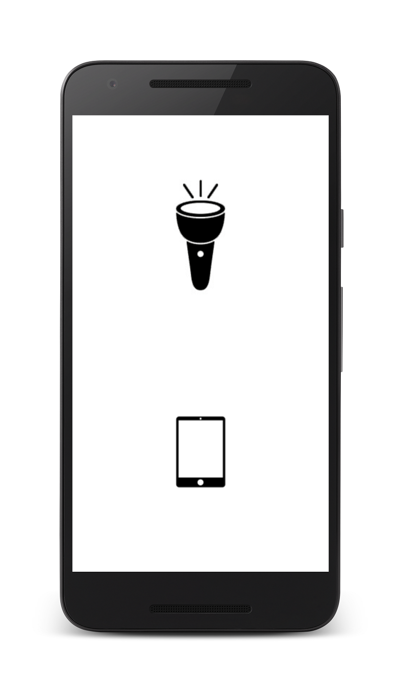

# Android-Flashlight
An Android flashlight without extra permissions. Works with phones without flash (change brightness of the screen)

#Now supports 14 languages

-cs, de, es, fr, hi, it, ja, ko, nl, pl, pt, ru, zh, eng

##Why I made this:
-I've seen so many apps that require to much permissions to work, and that's because they are gathering information about us, so I've decided I want to reduce that risk

-To learn more things about Android

-To have the chance to personalize my app

##Instructions:
This app work on phones with and without flash, so obviously when the device doesn't have flash the app will turn the screen brightness to it's maximum.

####-If you have a flash:

  -You can turn on and off the flash (when you pause or stop the application it'll turn off)
  
  -You can turn your screen brightness to it's maximum. (It'll glow so hard you'll became a photosynthetic human being)
  
####-If you DON'T have a flash:
  
  -You can turn your screen brightness to it's maximum. (It'll glow so hard you'll became a photosynthetic human being)

##Known Problems:

-If you have your screen brightness to adapt automatically, it won't work properly

##Credits:

Myself and a mix of these two apps, https://github.com/jbutewicz/Flashlight-by-Joe  and this https://github.com/devesh/Flashlight
